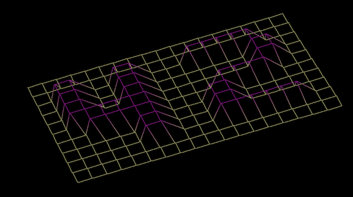
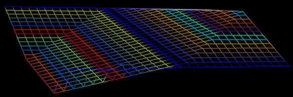
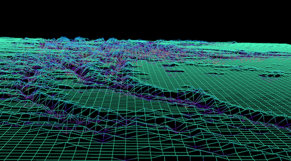

# FdF
This project is about creating a simple 3D graphic representation of a relief landscape. X, Y and Z coordinates are linked through lines, creating a wireframe ("fils de fer" in French, hence its name). This is the first graphic project and it introduces the graphics library and some of the mathematics I will be using for future projects.  

  
  
  

## Controls
Tilt forward: W  
Tilt backward: S   
Tilt left: A   
Tilt right: D   
Rotate left: arrow left  
Rotate right: arrow right  
Zoom in: arrow up   
Zoom out: arrow down    
Change color 1: [    
Change color 2: ]  
Different Z value changes color less: ;  
Different Z value changes color more: '  
